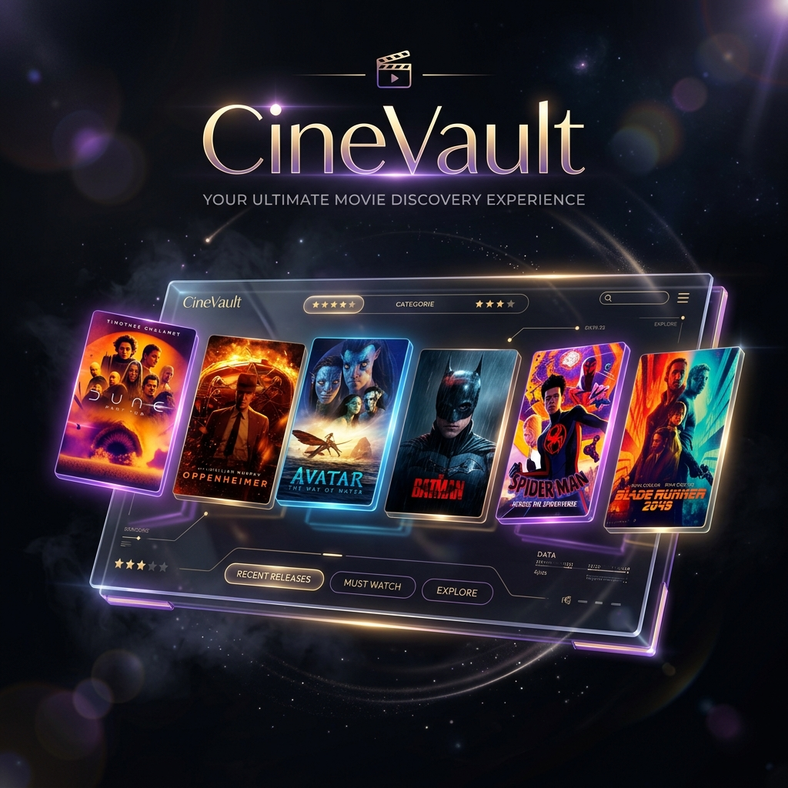

# CineVault — Movie Management System

A full-stack movie management and recommendation platform built with **Spring Boot**, **React + TypeScript**, and **Python FastAPI**, powered by the [MovieLens 32M](https://grouplens.org/datasets/movielens/) dataset.

---

## Architecture

```
┌─────────────────────────────────────────────────────────────┐
│                 React + TypeScript Frontend                 │
│                 localhost:3000 (Vite)                       │
└─────────────────────────────┬───────────────────────────────┘
                              ▼
┌─────────────────────────────────────────────────────────────┐
│                    Nginx Reverse Proxy                      │
│                    (Ports 80 / 443)                         │
└────────┬────────────────────────────────────┬───────────────┘
         │                                    │
         ▼                                    ▼
┌──────────────────┐               ┌─────────────────────────┐
│ Spring Boot API  │               │ Python Recommendation   │
│ (Java 17)        │               │ Service (FastAPI)       │
└─┬──────┬───────┬─┘               └────────────┬────────────┘
  │      │       │                              │
  ▼      │       ▼                              │
┌─────┐  │ ┌───────────┐                        │
│Redis│  │ │   Kafka   │──(Async processing)──┐ │
└─────┘  │ └───────────┘                      │ │
         ▼                                    ▼ ▼
┌─────────────────────────────────────────────────────────────┐
│                        MySQL Database                       │
│                        (~87K movies, 32M ratings)           │
└─────────────────────────────────────────────────────────────┘

[Observability Stack: Prometheus (9090) + Grafana (3000) + Zipkin (9411)]
```

---

## Tech Stack

| Layer | Technology |
|-------|-----------|
| **Frontend** | React 18, TypeScript, Vite 5, React Router 6, Tailwind/CSS |
| **Backend** | Spring Boot 3.1.5, MyBatis, Java 17 |
| **Recommendation** | Python 3, FastAPI, scikit-learn (TF-IDF + Cosine Sim) |
| **Database/Cache** | MySQL 8.0, Redis (for high-speed GET queries) |
| **Message Queue** | Apache Kafka + Zookeeper (for async POST ratings) |
| **Observability** | Prometheus, Grafana, Zipkin, Micrometer |
| **Containerization** | Docker, Docker Compose |
| **Load Testing** | Locust (Python) |
| **CI/CD** | GitHub Actions → Packer AMI build → AWS deployment |

---

## Features

- 🚀 **High Concurrency Ready** — Uses **Redis** caching for read-heavy operations and **Kafka** message queues for asynchronous, non-blocking writes.
- 📊 **Full-Stack Observability** — Integrated with Prometheus for metrics, Grafana for beautiful dashboards (JVM, DB pools, HTTP requests), and Zipkin for distributed request tracing.
- 🔍 **Movie Search** — Search by title across 87K+ movies.
- 🎬 **Movie Detail** — View genres, average rating, IMDb & TMDB links.
- 🖼️ **Movie Posters** — Real poster images fetched from TMDB API.
- ✨ **Smart Recommendations** — Content-based filtering using genre cosine similarity.
- 🔐 **User Authentication** — Register / Login with JWT tokens.
- 🌙 **Modern UI** — Glassmorphism design with animations.

---

## CI/CD Pipeline (GitHub Actions)

This project features a fully automated Continuous Integration and Continuous Deployment pipeline using **GitHub Actions**.

1. **Continuous Integration (CI)**: 
   - On every `git push`, a GitHub runner spins up an Ubuntu environment.
   - Installs **Java 17** and runs `mvn clean package` to build the Spring Boot `.jar` artifact.
   - Installs **Node.js 20** and runs `npm run build` to compile the React/Vite frontend into static files.
2. **Continuous Deployment (CD)**:
   - The compiled artifacts are passed to the **HashiCorp Packer** job.
   - Packer uses AWS credentials to launch a temporary EC2 builder instance in `us-east-1`.
   - It pre-installs the Python environment, configures Nginx, and registers the Java and FastAPI apps as `systemd` background services.
   - Finally, it bakes a production-ready **Amazon Machine Image (AMI)**, allowing infinite Auto-Scaling on AWS without any manual configuration.

---

## Local Development Setup

### Prerequisites

- Java 17+
- Maven 3.8+
- Node.js 18+
- Python 3.9+
- MySQL 8.0 (with `recommend` database loaded)

### 1. Clone the repository

```bash
git clone https://github.com/Shanaia0805/assignment-2-cloud-native-web-application-Shanaia0805.git
cd assignment-2-cloud-native-web-application-Shanaia0805
```

### 2. Start Spring Boot Backend (Terminal 1)

```bash
DB_URL="jdbc:mysql://127.0.0.1:3306/recommend?useSSL=false&allowPublicKeyRetrieval=true" \
DB_USERNAME="root" \
DB_PASSWORD="your_db_password" \
JWT_SECRET="your-secret-key-at-least-32-characters-long" \
mvn spring-boot:run
```

Backend runs on `http://localhost:8080`

### 3. Start Python Recommendation Service (Terminal 2)

```bash
cd recommendation
pip3 install -r requirements.txt
uvicorn main:app --port 8000 --reload
```

> First startup takes ~30s to build the recommendation model from 80K+ movies.

Recommendation service runs on `http://localhost:8000`

### 4. Start React Frontend (Terminal 3)

```bash
cd frontend
# Create .env.local with your TMDB API key (get free key at themoviedb.org)
echo "VITE_TMDB_API_KEY=your_tmdb_api_key" > .env.local

npm install
npm run dev
```

Frontend runs on `http://localhost:3000`

---

## API Endpoints

### Spring Boot (`/v1`)

| Method | Endpoint | Auth | Description |
|--------|----------|------|-------------|
| POST | `/v1/register` | No | Register new user |
| POST | `/v1/login` | No | Login, returns JWT token |
| GET | `/v1/movie/{id}` | Yes | Get movie by ID |
| GET | `/v1/movies/search?q=title` | Yes | Search movies by title |
| GET | `/v1/rating/{movieId}` | Yes | Get average rating |
| GET | `/v1/link/{movieId}` | Yes | Get IMDb & TMDB links |

### Python Recommendation Service

| Method | Endpoint | Description |
|--------|----------|-------------|
| GET | `/recommend/{movieId}?top=N` | Get top-N similar movies |
| GET | `/health` | Health check |

---

## Recommendation Algorithm

Uses **Content-Based Filtering** with the following approach:

1. Load all movies and their genres from MySQL on startup
2. Represent each movie as a TF-IDF vector based on its genres
3. Compute cosine similarity between all movie pairs
4. For a given movie, return top-N most similar movies sorted by similarity score

---

## AWS Cloud Architecture (Original)

The original project was deployed on AWS with:

- **EC2** instances in private subnets (Auto Scaling Group)
- **Network Load Balancer** in public subnets
- **Security Groups** controlling inbound/outbound traffic
- **Packer** to build custom AMIs with the application pre-installed
- **Terraform** for infrastructure as code
- **GitHub Actions** CI/CD pipeline: build → test → pack AMI → deploy

---

## Environment Variables

| Variable | Description |
|----------|-------------|
| `DB_URL` | MySQL JDBC connection URL |
| `DB_USERNAME` | Database username |
| `DB_PASSWORD` | Database password |
| `JWT_SECRET` | Secret key for JWT signing (min 32 chars) |
| `VITE_TMDB_API_KEY` | TMDB API key for movie posters (frontend only) |
